# Summary of 3_Linear

[<< Go back](../README.md)

## Logistic Regression (Linear)
- **n_jobs**: -1
- **explain_level**: 2

## Validation
 - **validation_type**: split
 - **train_ratio**: 0.75
 - **shuffle**: True
 - **stratify**: True

## Optimized metric
accuracy

## Training time

10.7 seconds

## Metric details
|           |    score |    threshold |
|:----------|---------:|-------------:|
| logloss   | 0.670399 | nan          |
| auc       | 0.85     | nan          |
| f1        | 0.818182 |   0.213014   |
| accuracy  | 0.870968 |   0.213014   |
| precision | 0.818182 |   0.213014   |
| recall    | 1        |   0.00444782 |
| mcc       | 0.718182 |   0.213014   |

## Confusion matrix (at threshold=0.213014)
|              |   Predicted as 0 |   Predicted as 1 |
|:-------------|-----------------:|-----------------:|
| Labeled as 0 |               18 |                2 |
| Labeled as 1 |                2 |                9 |

## Learning curves
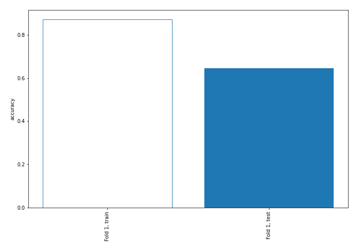

## Coefficients
| feature     |   Learner_1 |
|:------------|------------:|
| Cabin       |   0.162683  |
| Parch       |   0.0631086 |
| Embarked    |  -0.0298517 |
| Fare        |  -0.0544175 |
| Pclass      |  -0.0843111 |
| PassengerId |  -0.202191  |
| Age         |  -0.253342  |
| Name        |  -0.544968  |
| Ticket      |  -0.553316  |
| SibSp       |  -0.638571  |
| intercept   |  -1.02467   |
| Sex         |  -1.61137   |

## Permutation-based Importance
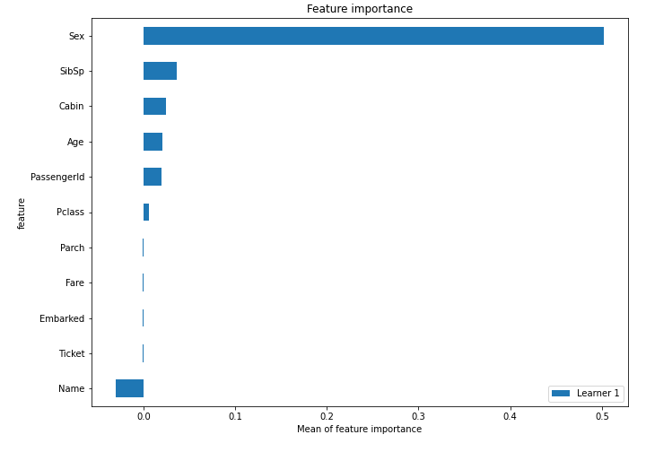
## Confusion Matrix

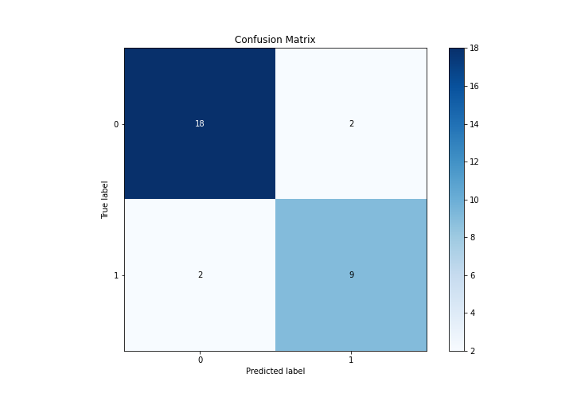

## Normalized Confusion Matrix

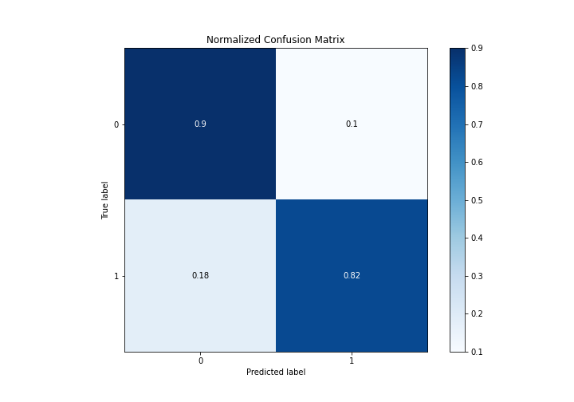

## ROC Curve

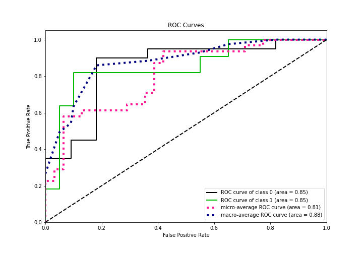

## Kolmogorov-Smirnov Statistic

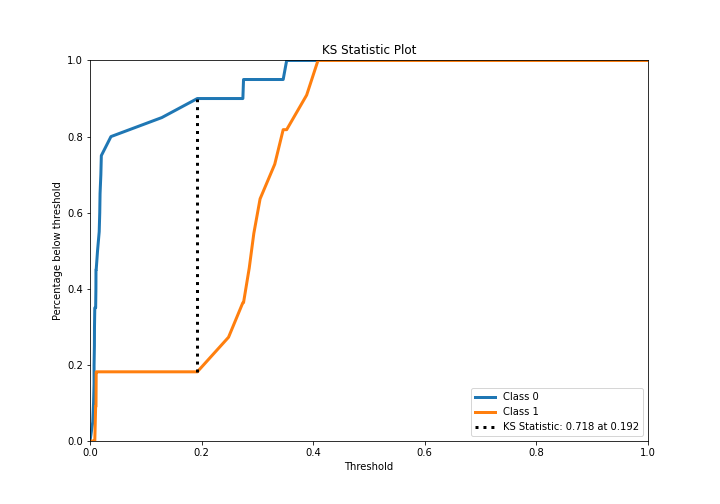

## Precision-Recall Curve

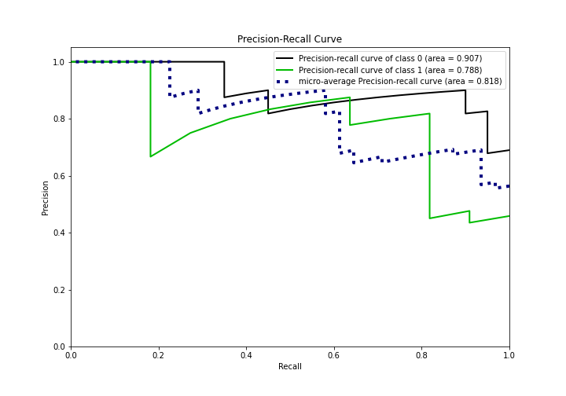

## Calibration Curve

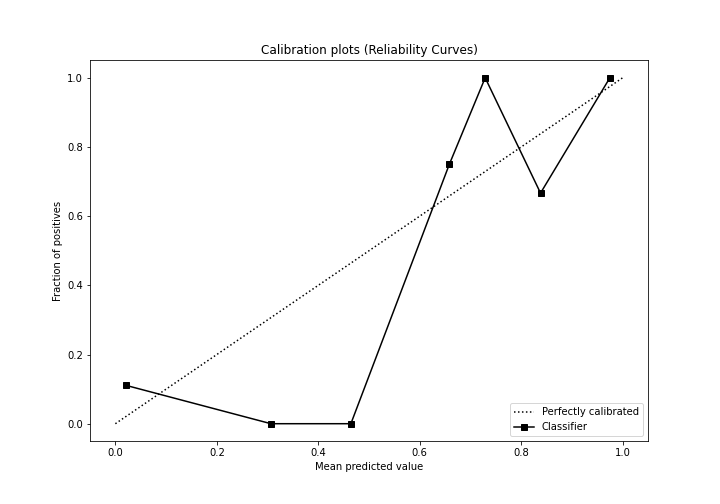

## Cumulative Gains Curve

## Lift Curve

## SHAP Importance
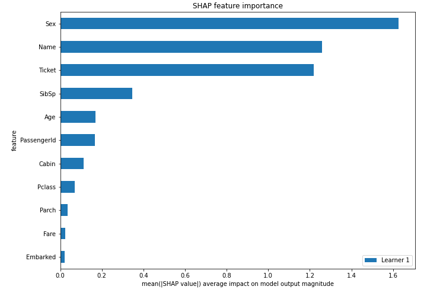

## SHAP Dependence plots

### Dependence (Fold 1)
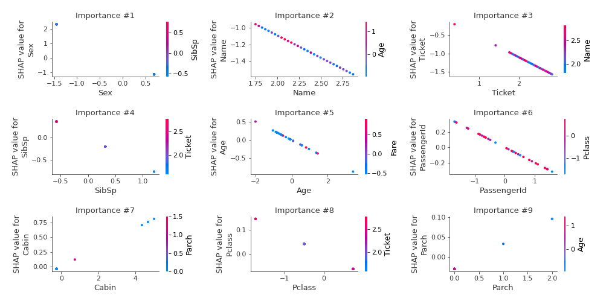

## SHAP Decision plots

### Top-10 Worst decisions for class 0 (Fold 1)
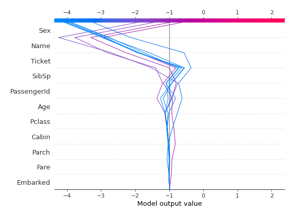
### Top-10 Best decisions for class 0 (Fold 1)
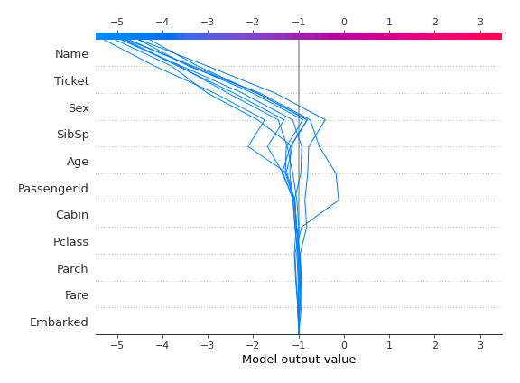
### Top-10 Worst decisions for class 1 (Fold 1)
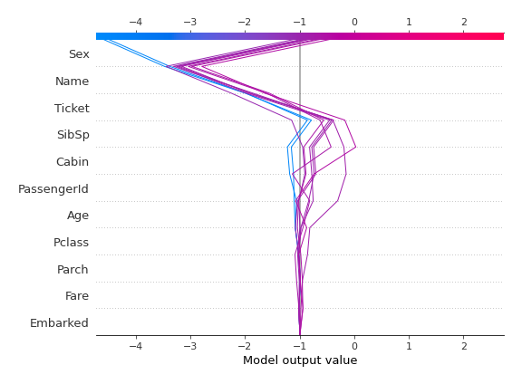
### Top-10 Best decisions for class 1 (Fold 1)
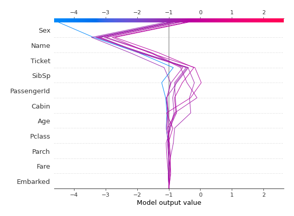

[<< Go back](../README.md)
