# Exploratory Data Analysis

[<< Go back](../README.md)
## Feature : target
- **Feature type** : discrete
- **Missing** : 0.0%
- **Unique** : 2
- **Count** :124.0
- **Mean** :0.3467741935483871
- **Std** :0.47787393035439
- **Min** :0.0
- **25%th Percentile** : 0.0
- **50%th Percentile** : 0.0
- **75%th Percentile** : 1.0
- **Max** :1.0

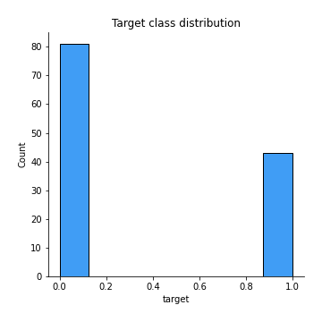
## Feature : PassengerId
- **Feature type** : discrete
- **Missing** : 0.0%
- **Unique** : 124
- **Count** :124.0
- **Mean** :79.04838709677419
- **Std** :45.87662047623476
- **Min** :1.0
- **25%th Percentile** : 40.75
- **50%th Percentile** : 77.0
- **75%th Percentile** : 119.5
- **Max** :156.0

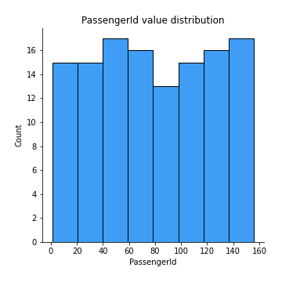
## Feature : Pclass
- **Feature type** : discrete
- **Missing** : 0.0%
- **Unique** : 3
- **Count** :124.0
- **Mean** :2.403225806451613
- **Std** :0.7955092947463277
- **Min** :1.0
- **25%th Percentile** : 2.0
- **50%th Percentile** : 3.0
- **75%th Percentile** : 3.0
- **Max** :3.0

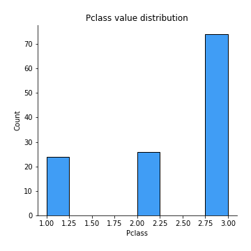
## Feature : Name
- **Feature type** : categorical
- **Missing** : 0.0%
- **Unique** : 124
- **Count** :124
- **Unique** :124
- **Top** :Rugg, Miss. Emily
- **Freq** :1

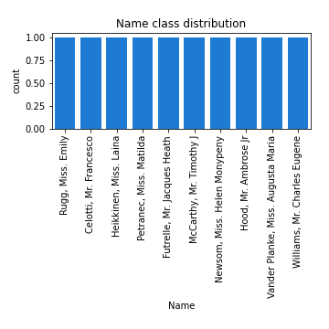
## Feature : Sex
- **Feature type** : categorical
- **Missing** : 0.0%
- **Unique** : 2
- **Count** :124
- **Unique** :2
- **Top** :male
- **Freq** :81

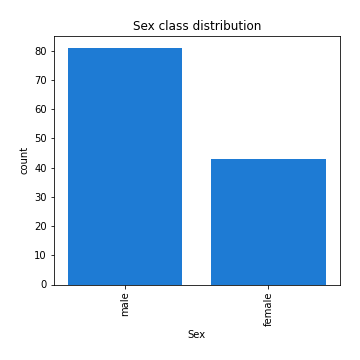
## Feature : Age
- **Feature type** : continous
- **Missing** : 17.741935483870968%
- **Unique** : 47
- **Count** :102.0
- **Mean** :28.112745098039216
- **Std** :13.620911933302327
- **Min** :2.0
- **25%th Percentile** : 20.0
- **50%th Percentile** : 26.5
- **75%th Percentile** : 35.0
- **Max** :70.5

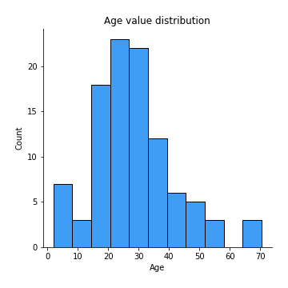
## Feature : SibSp
- **Feature type** : discrete
- **Missing** : 0.0%
- **Unique** : 6
- **Count** :124.0
- **Mean** :0.5887096774193549
- **Std** :1.028157217851936
- **Min** :0.0
- **25%th Percentile** : 0.0
- **50%th Percentile** : 0.0
- **75%th Percentile** : 1.0
- **Max** :5.0

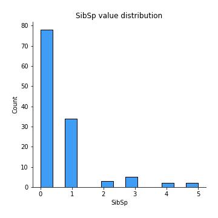
## Feature : Parch
- **Feature type** : discrete
- **Missing** : 0.0%
- **Unique** : 5
- **Count** :124.0
- **Mean** :0.3951612903225806
- **Std** :0.9000320535131885
- **Min** :0.0
- **25%th Percentile** : 0.0
- **50%th Percentile** : 0.0
- **75%th Percentile** : 0.0
- **Max** :5.0

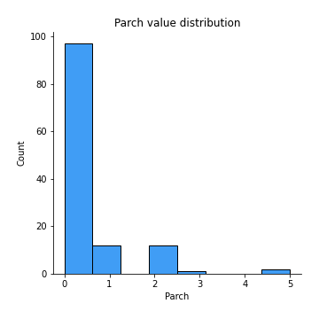
## Feature : Ticket
- **Feature type** : categorical
- **Missing** : 0.0%
- **Unique** : 118
- **Count** :124
- **Unique** :118
- **Top** :S.O.C. 14879
- **Freq** :2

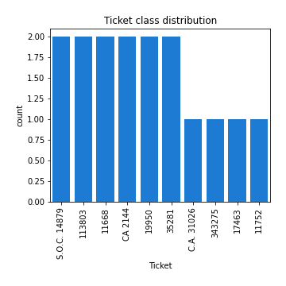
## Feature : Fare
- **Feature type** : continous
- **Missing** : 0.0%
- **Unique** : 81
- **Count** :124.0
- **Mean** :29.22667983870968
- **Std** :41.87534541265618
- **Min** :6.75
- **25%th Percentile** : 8.0448
- **50%th Percentile** : 13.7271
- **75%th Percentile** : 31.303124999999998
- **Max** :263.0

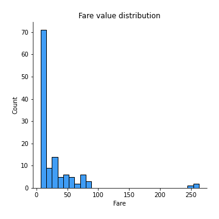
## Feature : Cabin
- **Feature type** : categorical
- **Missing** : 79.03225806451613%
- **Unique** : 23
- **Count** :26
- **Unique** :23
- **Top** :D26
- **Freq** :2

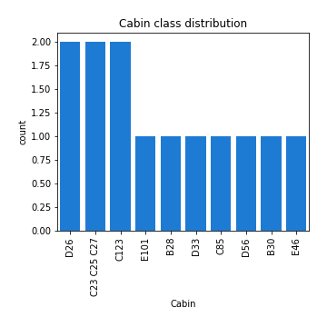
## Feature : Embarked
- **Feature type** : categorical
- **Missing** : 0.8064516129032258%
- **Unique** : 3
- **Count** :123
- **Unique** :3
- **Top** :S
- **Freq** :88

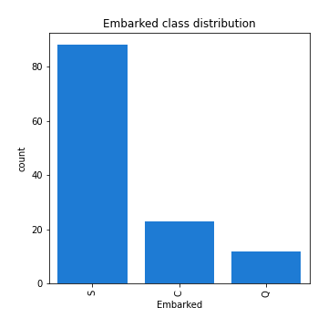

[<< Go back](../README.md)
