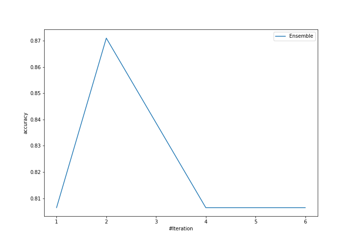
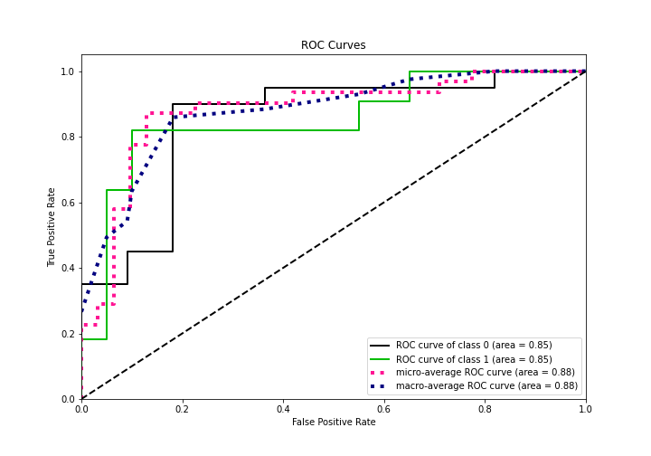
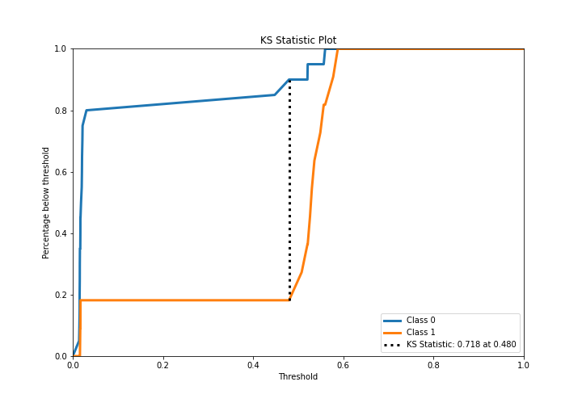
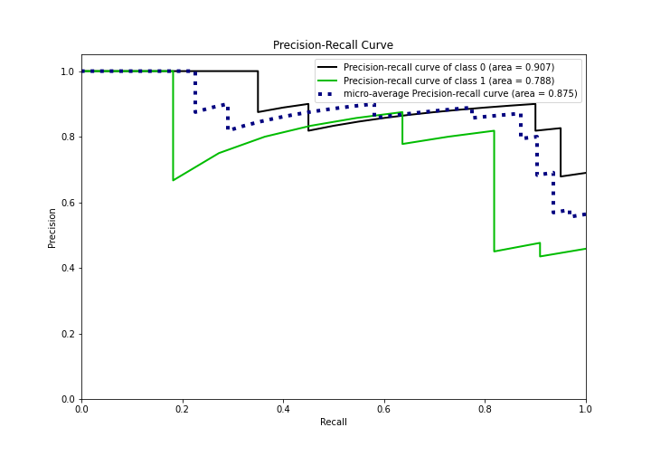
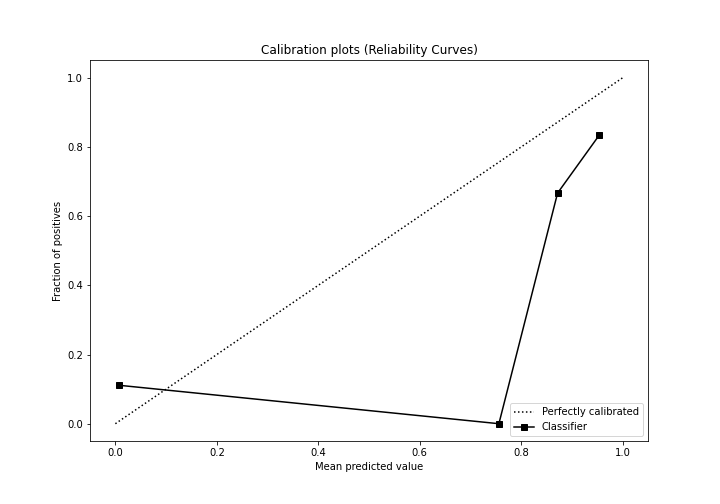
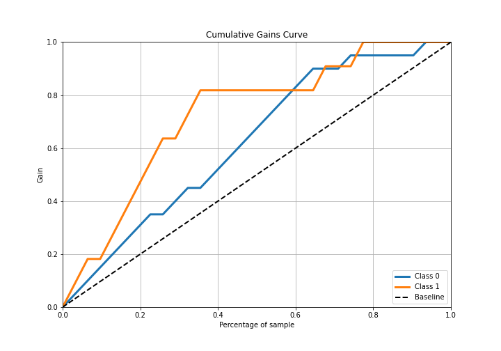
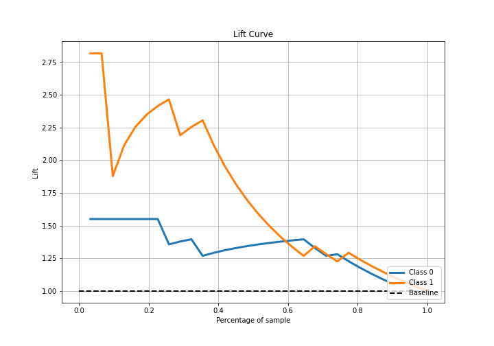

# Summary of Ensemble

[<< Go back](../README.md)

## Ensemble structure
| Model                  |   Weight |
|:-----------------------|---------:|
| 3_Linear               |        1 |
| 6_Default_RandomForest |        1 |

## Metric details
|           |    score |   threshold |
|:----------|---------:|------------:|
| logloss   | 0.540512 |  nan        |
| auc       | 0.85     |  nan        |
| f1        | 0.818182 |    0.502761 |
| accuracy  | 0.870968 |    0.502761 |
| precision | 0.818182 |    0.502761 |
| recall    | 1        |    0.012689 |
| mcc       | 0.718182 |    0.502761 |

## Confusion matrix (at threshold=0.502761)
|              |   Predicted as 0 |   Predicted as 1 |
|:-------------|-----------------:|-----------------:|
| Labeled as 0 |               18 |                2 |
| Labeled as 1 |                2 |                9 |

## Learning curves

## Confusion Matrix

## Normalized Confusion Matrix

## ROC Curve

## Kolmogorov-Smirnov Statistic

## Precision-Recall Curve

## Calibration Curve

## Cumulative Gains Curve

## Lift Curve

[<< Go back](../README.md)
